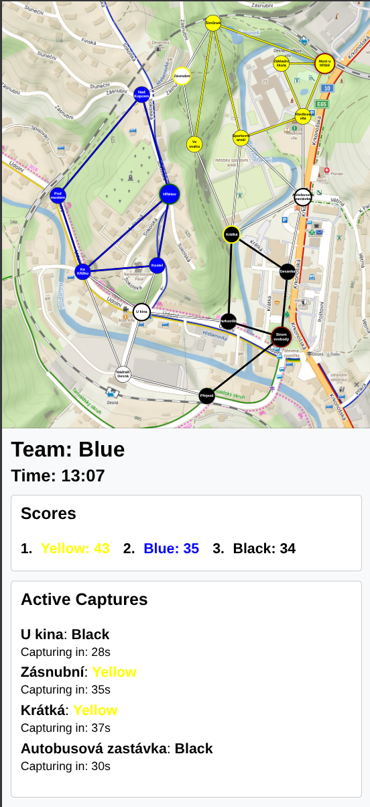

# Swordmap Game

## Setup

1.  **Install Dependencies**:
    ```bash
    python3 -m venv venv
    source venv/bin/activate
    pip install -r requirements.txt
    ```

2.  **Configuration**:
    -   Edit `game_config.json` to define zones, bases, and their coordinates.
        ```json
            "id": <number>,
            "name": <string>,
            "x": <number>,
            "y": <number>,
            "is_base": <bool>,
            "owner": <string>, # Name of team, only when is_base is true
            "color": <color>, # Hex code, should be #FFFFFF, if neutral, else color of team
            "adjacent_zones": <list(number)> # List of ids of adjacent zones 
        ```
    -   Teams are automatically created based on zones marked as `is_base: true`. The `owner` field determines the team name, and the `color` field determines the team color.
    -   Running `init_game_data` will reset all team scores to 0.
    -   Place your map image at `game/static/game/map.png`.

3.  **Initialize Database**:
    ```bash
    python manage.py migrate
    python manage.py init_game_data
    ```

4.  **Run Server**:
    ```bash
    python manage.py runserver
    ```

5.  **Game Loop**:
    ```bash
    python manage.py process_game_state
    ```

## Usage



-   Go to `http://localhost:8000/` (default).
-   Choose your role (Admin, Yellow, Blue, Black).
-   Click on zones to capture/defend.

## Pravidla hry

### Cíl hry

Cílem hry je nasbírat co nejvíce bodů obsazováním a držením strategických pozic na mapě.

### Týmy a vybavení

- Hráči jsou rozděleni do 3 týmů.
- Každý hráč je vybaven zbraní (KNG nebo meč).
- Hra začíná na základně každého týmu.
- Každý hráč má 3 životy.

### Obsazování

- Pozici lze začít obsazovat pouze pokud je připojena přes vlastní území k základně. Základny nelze obsazovat.
- Proces obsazení:
    1. Hráč dojde na místo a klikne na pozici v aplikaci.
    2. Spustí se odpočet 60 vteřin.
    3. Pokud tým udrží pozici po dobu odpočtu, pozice je obsazena.

### Přerušení obsazování

- Nepřátelský tým může přijít na zabíranou pozici a kliknutím v aplikaci zrušit probíhající odpočet.
- Pro přerušení obsazení je třeba splnit stejnou podmínku jako pro obsazování, tedy pozice musí být připojena přes vlastní území k základně.
- Pokud je tam přítomen hráč obsazující území, musí být vyzván na souboj. Vítěz může znovu zahájit proces obsazování.

### Souboj

- Na souboj lze vyzvat kohokoli kdekoli, ne nutně při obsazování pozic. To netřeba dělat nijak formálně, pouze pokud vyzývaný zrovna obsluhuje aplikaci, musí ho vyzývající vyzvat slovně v rámci fair play, aby měl vyzvaný šanci odložit telefon do kapsy.
- Do souboje se může zapojit libovolný počet lidí z různých týmů, mohou se zapojit i v průběhu souboje.
- Zásahem do platné zóny ztrácí hráč jeden život. Do platné zóny patří skoro celé tělo (od rukou výše, od kolen výše, trup). Hlava a krk jsou zakázané zóny.
- Po ztrátě všech 3 životů hráč zvedne zbraň nad hlavu a musí se vrátit na základnu pro oživení.
- Při libovolné návštěvě své základny jsou životy resetovány.

### Bodování

- **Obsazení bodu**: +5 bodů (jednorázově).
- **Držení bodu**: +1 bod za každou minutu, kdy je bod ve vlastnictví týmu.
- Vítězí tým s nejvyšším počtem bodů na konci hry.
